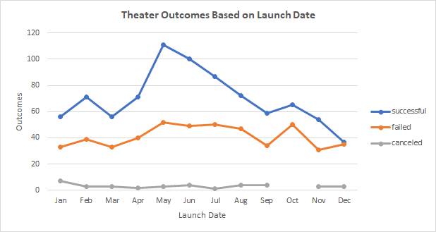

# Kickstarting with Excel
Performing analysis on Kickstarter data to uncover trends
## Overview of Project: 
This project uses Excel to organise, sort and analyze a dataset consisting of over 4,000 crowdfunding projects to uncover hidden trends. The results of the analysis will provide insights in how to plan a fundraising campaign to fund a play estimated to cost about $10,000. The analysis will help to determine whether there are specific factors that make theatrical production fundraising campaigns successful.

### Purpose: 
To determine how theatrical production campaigns fared in relation to their launch dates and funding goals, and generate insights that will help in mirroring successful campaigns. 

## Analysis and Challenges: 
Data preparation steps taken prior to starting this analysis include sorting, filtering and formatting the dataset to convert data into readable and easy to use formats to facilitate the generation of more insights. The analysis was performed using the [Kickstarter_analysis](https://github.com/aobasuyi/kickstarter-analysis/blob/main/Kickstarter_Challenge.xlsx) dataset.

### Analysis of Outcomes Based on Launch Date
The first deliverable was to determine if there were certain times of the year when theatrical production campaigns tend to be more successful. Steps taken to achieve this include,
- First, create a pivot table from the KickStarter worksheet and place the pivot table in a new sheet labelled "Theater Outcomes by Launch Date."
- Next, filter the pivot table based on "Parent Category" and "Years."
- Filter the column labels to show only "successful," "failed," and "canceled."
- Filter the "Parent Category" to show only the data for "theater."
- Sort the campaign outcomes in descending order so "successful" is first.
- Finally, create a line chart from the pivot table to visualize the relationship between outcomes and launch month.   **.

### Analysis of Outcomes Based on Goals
The second deliverable was to visualize the percentage of successful, failed, and canceled plays based on the funding goal amount. Steps to achieve this include,
- First create a new sheet KickStarter worksheet and label it "Outcomes Based on Goals." 
- In the new sheet, create the following eight columns to hold the data; “Goal”, “Number Successful”, “Number Failed”, “Number Canceled”, “Total Projects”, “Percentage Successful”. “Percentage Failed”, “Percentage Canceled”.
- In the “Goal” column, create dollar-amount ranges so projects can be grouped based on their goal amount. (Refer to the [Kickstarter_analysis](https://github.com/aobasuyi/kickstarter-analysis/blob/main/Kickstarter_Challenge.xlsx) dataset)
- Use the COUNTIFS() functions to populate the "Number Successful," "Number Failed," and "Number Canceled" columns.
  - This is achieved by using filtering on the kickstarter worksheet "outcome" column, on the "goal" amount column using the dollar-amount ranges, and on the "Subcategory" column using "plays" as the criteria.
- Use SUM() to calculate the sum of "Total Projects" column with the number of successful, failed, and canceled projects for each row.
- Then calculate the percentage of successful, failed, and canceled projects for each row.
- Finally, create a line chart titled "Outcomes Based on Goal" to visualize the relationship between the goal-amount ranges on the x-axis and the percentage of successful, failed, or canceled projects on the y-axis.   **

### Challenges and Difficulties Encountered
Minor challenges encountered during the project consisted mostly of “error messages” when populating the "Number Successful," "Number Failed," and "Number Canceled" columns using the COUNTIFS function. These were easily fixed by checking that the “criteria” for "outcome", the "Subcategory" and the “goal amount ranges” in the COUNTIFS() formula were entered correctly in the formula bar. 

## Results

**Conclusions about “Outcomes based on Launch Date”:**  
The month that launched the most successful theatrical production campaigns was May. However, January, March, September, November and December all had roughly the same number of failed campaigns launched. Further, January has the most canceled campaigns. These results, based on this dataset, suggest that fundraising campaigns set between May and June have the most chance of success.  

**Conclusions about the “Outcomes based on Goals”:** 
Successful Kickstarter campaigns in the dollar-amount range of "less than $1000" were the most successful. The next successful Kickstarter campaigns were in the dollar-amount range of “1000 to 4999”. Kickstarter campaigns in the dollar-amount range of “45000 to 49999 have 100 percent chance of failure. These results, based on this dataset, suggest that a fundraising campaign to fund a play estimated to cost about $10,000 will have about 55% chance of success. . 

**Some limitations of this dataset:** 
The calculation of the "Total Projects" in the “Outcomes Based on Goals” worksheet resulted in a discrepancies in the summed total amount. between the summed total of 1043 ( in this worksheet) and 1066 (in the Kickstarter worksheet). Using the dollar-amount range of “>50000” instead of “>=50,000” resulted in exclusion of 4 projects in this range. Not including “live” outcomes in the COUNTIFs()criteria also resulted in exclusion of 19 projects which could provide insights in live campaigns.  

**Other possible tables and/or graphs that could be created:**
- To consider comparing the "goals" and "pledged" amounts of failed and successful theatrical production campaigns to determine whether there are trends between campaign goals and amounts pledged.
- To create a box plot of identity outliers and consider filtering extreme data points not representative of the data we want for a particular analysis (e.g. campaign goal of $10,000) to enable the generation of more useful insights to plan a successful campaign.
